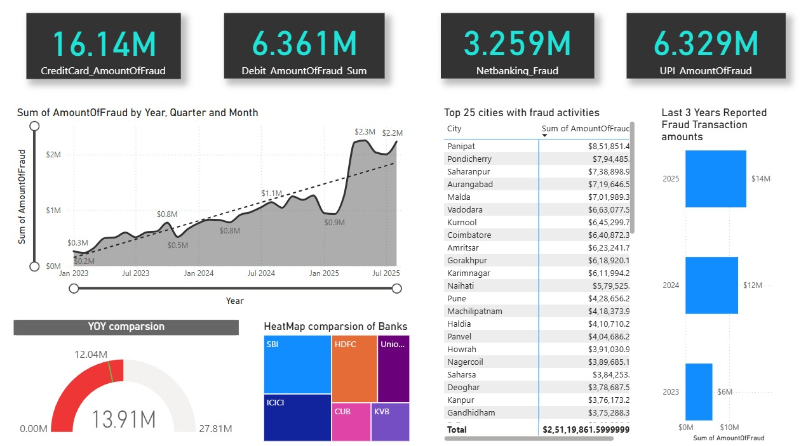
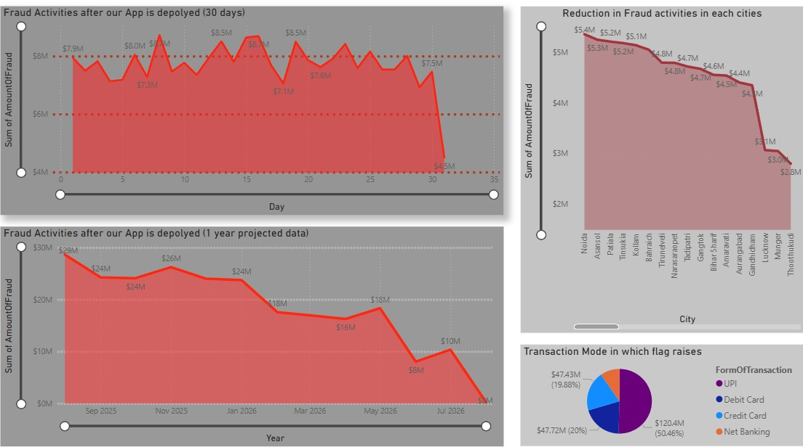
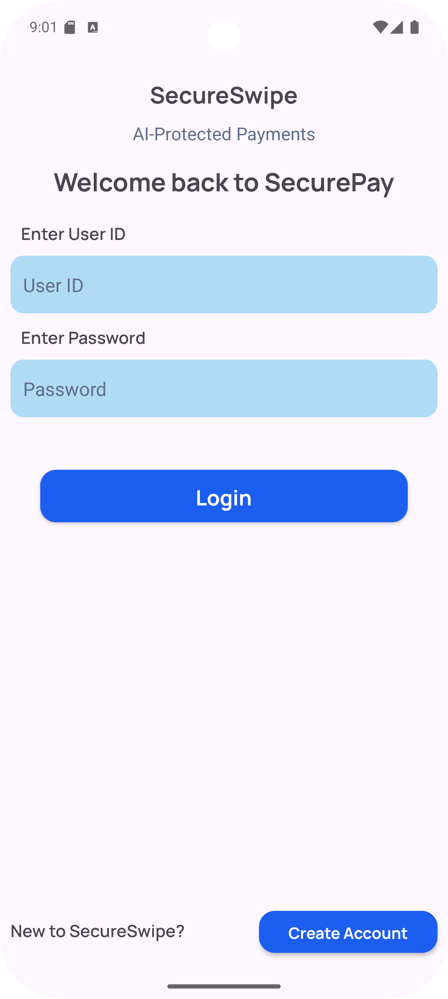
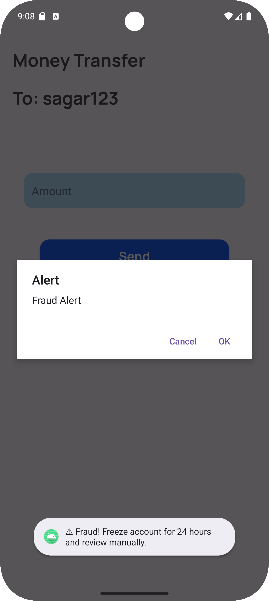

# SecureSwipe

# SecureSwipe Fraud Detection Dashboards

This repository contains dashboards showcasing the current and projected scenarios of payment fraud detection with SecureSwipe.

---

## Dashboard 1 (Blue): Current Fraud Scenario

**Overview:**

This dashboard provides a snapshot of the present landscape of payment fraud across multiple channels including UPI, net banking, credit, and debit cards.

**Key Highlights:**

- High volumes of fraud incidents and anomalies detected.
- Identification of vulnerable payment methods and cities most affected by fraud.
- Year-on-year statistics and trends for quick insight into evolving fraud patterns.
- Heatmaps and charts to pinpoint fraud hotspots and common fraud types.

**Purpose:**

To present a clear and comprehensive view of existing fraud challenges before the implementation of SecureSwipe's Machine Learning model.

---

## Dashboard 2 (Red): Projected ML-Enhanced Scenario

**Overview:**

This dashboard projects the anticipated improvements after deploying SecureSwipe’s AI-powered fraud detection model.

**Key Highlights:**

- Significant reduction in fraud cases through adaptive machine learning.
- Trendlines illustrating enhanced fraud detection as the model learns continuously.
- Visual representation of declining fraud totals and fewer flagged transactions in major cities.
- Pie and bar charts showcasing safer transaction methods and improved detection rates.

**Purpose:**

To demonstrate the positive impact and growing efficiency of SecureSwipe’s ML model over time.

---

## Summary

These dashboards together provide stakeholders with:

- A clear understanding of current fraud risks.
- Data-driven projections on the effectiveness of AI-enhanced fraud detection.
- Visual tools to track progress and identify ongoing risks.

---

*SecureSwipe - Empowering secure payments with AI-driven fraud prevention.*

## Screenshots

